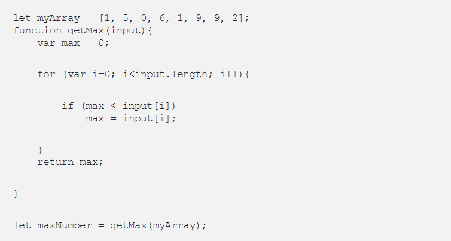
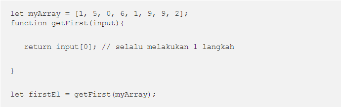
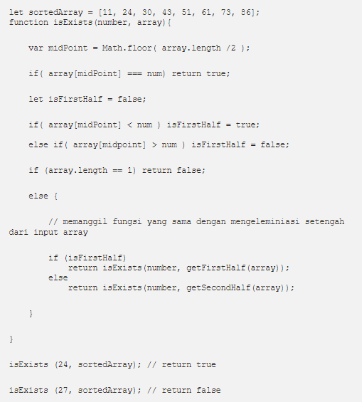
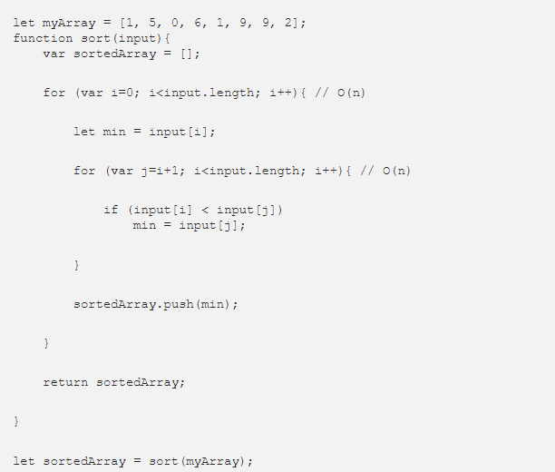

## Nama           : Putri Tari Lestari
## NIM            : 2110131120002
## Mata Kuliah    : Desain dan Analisis Algoritma
## Dosen Pengampu : Muhammad Hifdzi Adini, M.Kom
<h2>&nbsp &nbsp &nbsp &nbsp &nbsp &nbsp &nbsp &nbsp &nbsp &nbsp &nbsp &nbsp &nbsp &nbsp &nbsp &nbsp Dr. Ati Sukmawati, M.Kom</h2>
 
 

<h1 align=center> NOTASI O BESAR (BIG O)

<h2 align=center><i>"Every good programmer will use the most effective and efficient ways to solve their problem. And to do that, we must know how to minimize the complexity."</i></h2>

 

"Setiap programmer yang baik akan menggunakan cara yang paling efektif dan efisien untuk memecahkan masalah mereka. Dan untuk melakukan itu, kita harus tahu bagaimana meminimalkan kerumitannya."

## Apa itu Big'O Nation?

Big-O Notation adalah cara untuk mengkonversi keseluruhan langkah-langkah suatu algoritma kedalam bentuk Aljabar, yaitu dengan menghiraukan konstanta yang lebih kecil dan koefisien yang tidak berdampak besar terhadap keseluruhan kompleksitas permasalahan yang diselesaikan oleh algoritma tersebut.

Mari kita liat contoh dibawah ini: 

| Regular | Big-O |
| -------- | ---------|
| 2 | O(1)   --> It's just a constant number |
| 2n + 10 | O(n)   --> n has the largest effect |
| 5n^2 | O(n^2) --> n^2 has the largest effect |

Sederhananya, semua contoh yang ada diatas mengatakan bahwa <i>“kita hanya akan melihat faktor yang memiliki dampak paling besar terhadap nilai yang dihasilkan oleh algoritma tersebut”.</i>

## O(1) — Constant Time
 

Constant Time artinya banyaknya input yang diberikan kepada sebuah algoritma, tidak akan mempengaruhi waktu proses (runtime) dari algoritma tersebut.

Contoh di atas terdapat sebuah fungsi untuk mengambil elemen pertama dari sebuah input array. Kita bisa melihat bahwa berapapun jumlah array yang diberikan kepada fungsi tersebut, dia akan selalu melakukan 1 hal, yaitu mengambil elemen pertama. Itu artinya <i>jumlah input yang diberikan tidak mempengaruhi waktu proses (runtime) dari algoritma tersebut.</i>

## O(log n) — Logarithmic Time

Logarithmic Time artinya ketika kita memberikan input sebesar n terhadap sebuah fungsi, jumlah tahapan yang dilakukan oleh fungsi tersebut berkurang berdasarkan suatu faktor. Salah satu contohnya adalah algoritma Binary Search.

Binary Search adalah algoritma yang kita gunakan dalam mencari posisi nilai dari suatu array dengan cara ‘mengeliminasi’ setengah dari array input untuk mempercepat proses pencarian.

## O(n) — Linear Time
 

Linear Time adalah ketika runtime dari fungsi kita berbanding lurus dengan jumlah input yang diberikan.

Kita bisa melihat bahwa semakin banyak jumlah input yang diberikan, maka waktu proses/runtime dari fungsi tersebut akan semakin besar.

## O(n²) — Quadratic Time
 

Quadratic Time adalah ketika runtime dari fungsi kita adalah sebesar n^2, dimana n adalah jumlah input dari fungsi tersebut. Hal tersebut bisa terjadi karena kita menjalankan fungsi linear didalam fungsi linear (n*n).

## O(2^n) — Exponential Time
 

Exponential Time biasanya digunakan dalam situasi dimana kita tidak terlalu tahu terhadap permasalahan yang dihadapi, sehingga mengharuskan kita mencoba setiap kombinasi dan permutasi dari semua kemungkinan.
 

<b>Sumber : Artikel dari <a href="https://medium.com/bee-solution-partners/penjelasan-sederhana-tentang-time-complexity-dan-big-o-notation-4337ba275cfe">Asep Maulana Ismail</a>