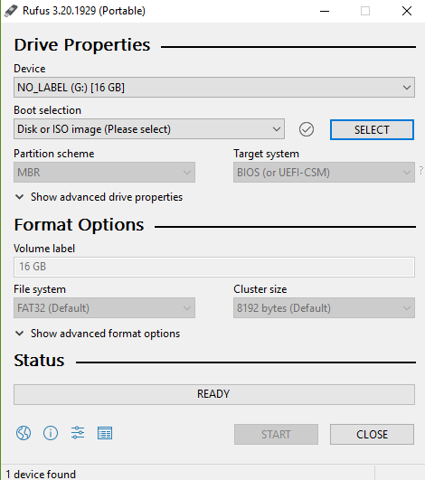
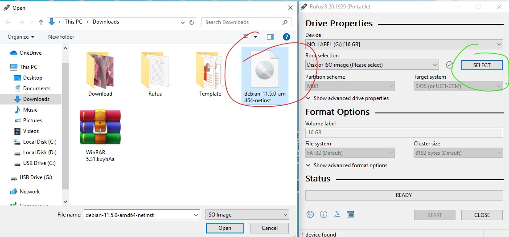
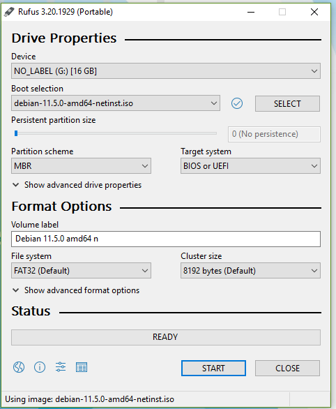
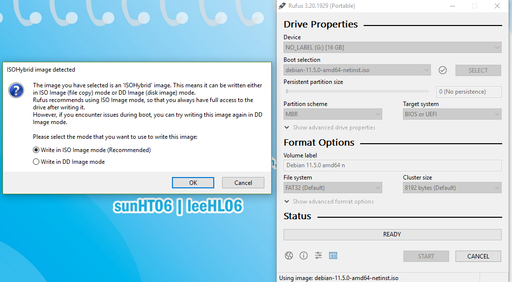
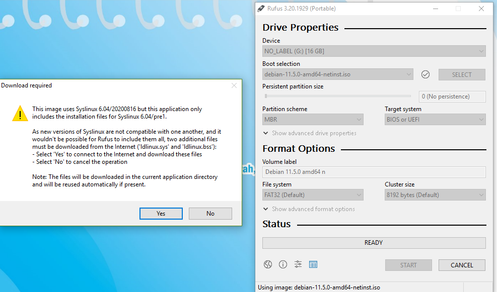
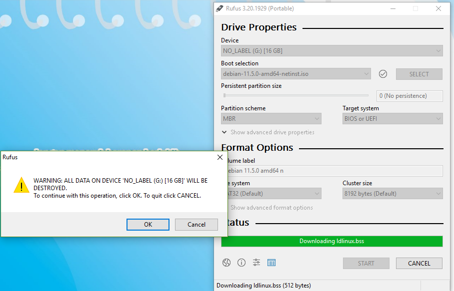
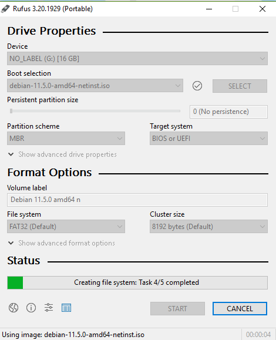
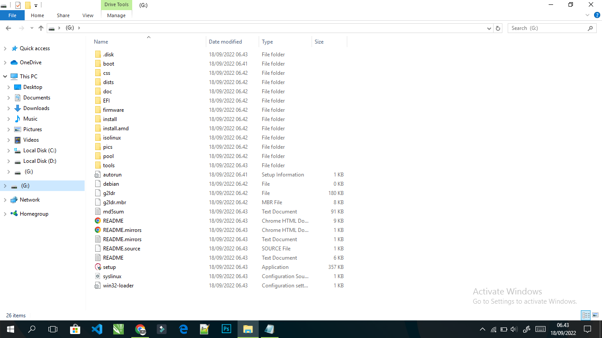

## Nama           : Putri Tari Lestari
## NIM            : 2110131120002
## Matkul         : Sistem Operasi (Praktikum)
## Asisten Dosen  : Kak Riduan & Kak Yogi
## Dosen Pengampu : Dr. Harja Santana Purba, M.Kom
<h2>&nbsp &nbsp &nbsp &nbsp &nbsp &nbsp &nbsp &nbsp &nbsp &nbsp &nbsp &nbsp &nbsp &nbsp &nbsp &nbsp Novan Alkaf Bahraini Saputra, S.Kom., M.T</h2>

 
 
<h1 align=center>Instalisasi Bootable Debian di Flashdisk</h1>
 
 

### Apa itu Debian?
 

Menurut Benefitia di dalam unggahan NIAGAHOSTER Blog, Debian adalah sistem operasi berbasis Linux yang lagi mulai naik daun. Situs populer seperti Kumparan, Jetbrains, hingga Getpocket, misalnya, mengadopsi Debian sebagai sistem operasi untuk anak website mereka (subdomain). Debian adalah sistem operasi gratis berbasis kernel Linux yang mampu memenuhi kebutuhan penggunanya lewat puluhan ribu software di dalamnya. Sedangkan kernel, merupakan inti dari sistem operasi. Gunanya, untuk mengelola semua aplikasi pada perangkat keras komputer. Mulai dari manajemen memori, proses, hingga penyimpanannya. Ibarat bus, untuk menjalankan mesinnya alias kernel, Anda membutuhkan supir. Yang tak lain adalah Debian itu sendiri.

### Cara instalisasi Debian di Flashdisk

 1. Download terlebih dahulu Rufus yaitu aplikasi portabel sumber terbuka dan gratis untuk Microsoft Windows yang dapat digunakan untuk memformat dan membuat USB flash drive yang dapat di-boot atau Live USB. Aplikasi ini dikembangkan oleh Pete Batard dari Akeo Consulting. Saya mendowloadnya <a href="https://rufus.ie/en/">di sini</a>.

 2. Siapkan flashdisk dan sambungkan pada laptop.

 3. Jika sudah selesai, maka buka aplikasi Rufus. Tampilannya akan seperti gambar di bawah ini.

 4. Lalu pilih SELECT dan cari letak Debian yang tersimpan di File Explore, jika di laptop saya, letaknya ada di Download, yaitu seperti gambar di bawah ini. 

  _Ket : Lingkaran hijau adalah pilihan pertama, lalu lingkaran merah adalah Debian yang saya pilih._

 5. Jika sudah dipilih, maka tinggal mengatur Partion Scheme, Target system, dan juga Format Option. Untuk Partion Scheme disarankan memilih MBR agar Target System-nya bisa dilakukan secara BIOS atau UEFI. Sedangkan untuk Format Option biarkan saja Default, seperti gambar di bawah. Apabila sudah, pilih START.

 

 6. Maka akan muncul perintah-perintah seperti di bawah ini, kita hanya perlu memilih OK atau YES untuk melanjutkan. Sebab inti dari perintahnya adalah berupa pemberitahuan bahwa apa yang ada di Flashdisk kita akan digantikan oleh instalisasi bootable.

 

 

 

 7. Selanjutnya tinggal menunggul proses instalisasi sampai selesai.

 

 8. Jika sudah selesai, tampilannya akan seperti gambar di bawah ini.

 

 9. Kita bisa cek isi Flashdisk apabila ingin memastikannya.

 

 10. Instalisasi Debian pada Flashdisk pun selesai. Terima kasih.