## Nama           : Putri Tari Lestari
## NIM            : 2110131120002
## Matkul         : Sistem Operasi (Praktikum)
## Asisten Dosen  : Kak Riduan & Kak Yogi
## Dosen Pengampu : Dr. Harja Santana Purba, M.Kom
<h2>&nbsp &nbsp &nbsp &nbsp &nbsp &nbsp &nbsp &nbsp &nbsp &nbsp &nbsp &nbsp &nbsp &nbsp &nbsp &nbsp Novan Alkaf Bahraini Saputra, S.Kom., M.T</h2>

 
 
<h1 align=center>Instalisasi Debian di Flashdisk</h1>
 
 

Ketika akan menginstall system operasi baik Windows maupun Linux pada computer/laptop umumnya menggunakan CD. Namun, jika computer/laptop tidak ada DVD ROM-nya maka instalasi dapat dilakukan melalui flashdisk bootable.

### Apa itu Flashdisk Bootable?

Flashdisk bootable adalah flashdisk yang sudah diformat agar dapat digunakan untuk booting pada computer/laptop seperti halnya CD dan hardisk. Ia berasal dari flashdisk biasa. Flashdisk merek dan jenis apapun dapat dijadikan bootable.

Di sini, saya akan melakukan instalisasi debian ke dalam flashdisk dengan bootable yang sudah saya buat di dalam flashdisk yang lain juga sebelumnya. Kamu bisa memeriksa prosesnya <a href="https://github.com/putritta06/my_repository/blob/master/SISTEM_OPERASI/Tugas%20Praktikum2_Instalisasi%20Bootable%20Debian_Putri%20Tari%20Lestari_2110131120002.md"> di sini </a>

Ada pun langkah-langkah proses di atas adalah sebagai berikut :

 1. Siapkan dua buah flashdisk. Satu flashdisk merupakan bootable yang berisi linux, satu lagi flashdisk yang masih kosong.
 2. Lakukan proses restart pada laptop kalian jika dalam keadaan hidup, namun apabila sebaliknya, kamu cukup menghidupkannya dan bersiap untuk menekan f2 pada keyboard. Tujuannya agar bisa ke menu BIOS.
 3. Apabila telah berada di dalam BIOS, cari menu boot dan prioritaskan flashdisk ke paling atas. Seperti tampilan gambar di bawah :
 4. Jika telah selesai, silahkan simpan dan keluar dari menu BIOS.
 5. Selanjutnya kamu akan dibawa menuju tampilan baru yaitu debian yang telah diinstal dalam flashdiks bootable sebelumnya. Tampilannya akan seperti gambar di bawah ini.
 6. Hubungkan flashdisk yang masih kosong untuk melakukan instalilasi linux ke dalamnya.
 7. Pilih ikon install debian pada bagian gambar yang saya lingkari di bawah ini hingga akan muncul tampilan debian installer. Tekan next untuk melanjutkan.

 
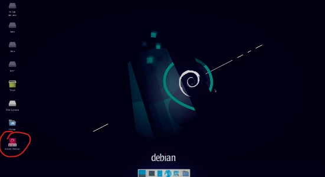

 
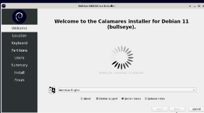

 8. Atur waktu setempat seperti di bawah ini.

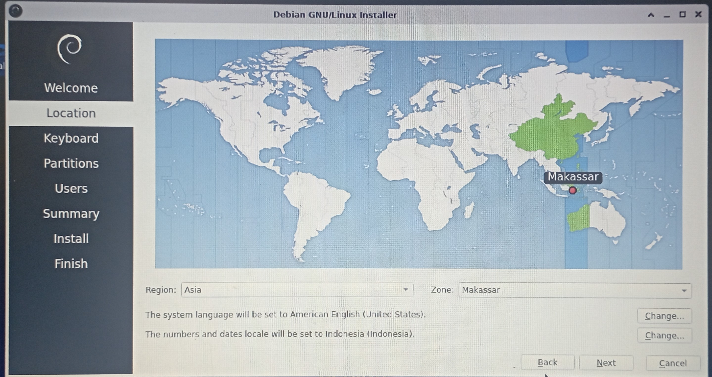

 9. Atur keyboard pilih yang default saja.

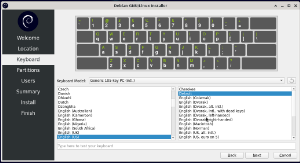

 10. Pilih partisi yang manual.

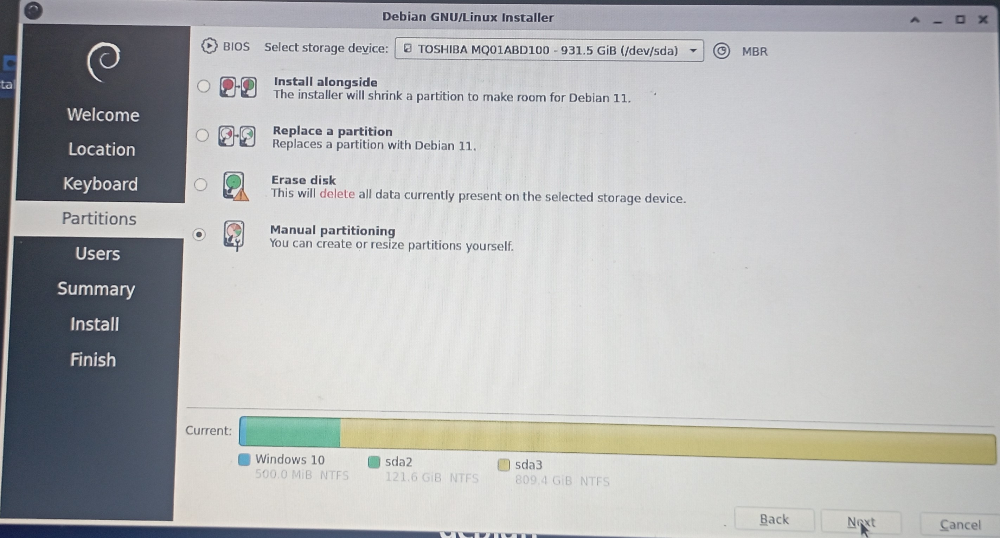

 11. Untuk laptop saya (merk Dell), disarankan pilih MBR, lalu next.

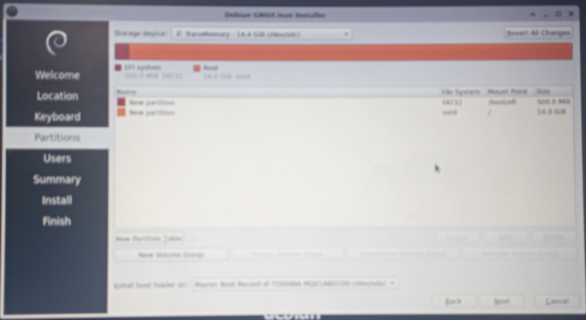

 12. Pilih flashdisk yang akan menyimpan hasil instalisasi dan tekan next.

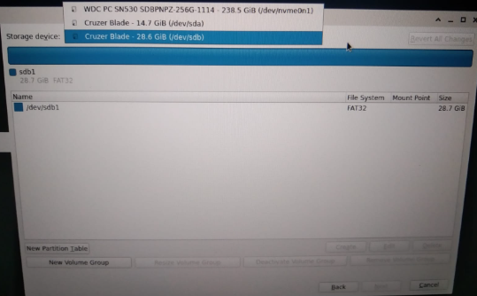

 13. Pilih Create dan ikuti langkah-langkah berikut :

 - Tulis Size sebesar 500mb, File System fat32, Mount Point tulis /boot/efi, dan flags centang bagian boot.

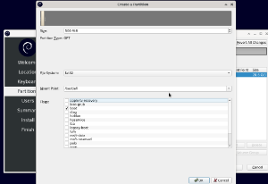

 - Pilih Create lagi, untuk Size biarkan saja, File System ext4, Mount Point tulis garis miring pada keyboard, dan flags pilih root.

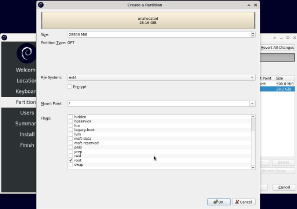

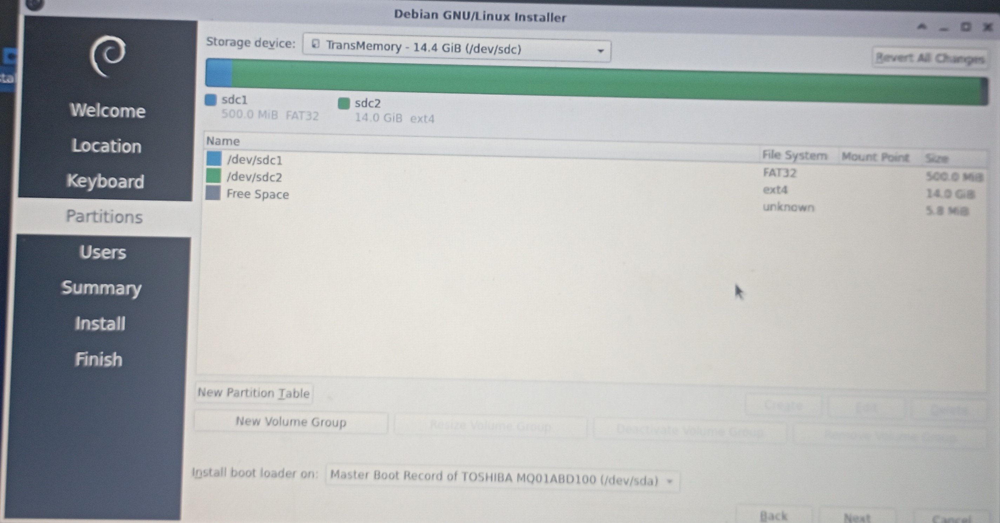

 14. Jika telah selesai, maka tampilan akan seperti gambar di bawah. Untuk melanjutkan tekan next.

 

 15. Atur user dan password, disarankan untuk menggunakan password yang singkat agar mudah diingat.

 
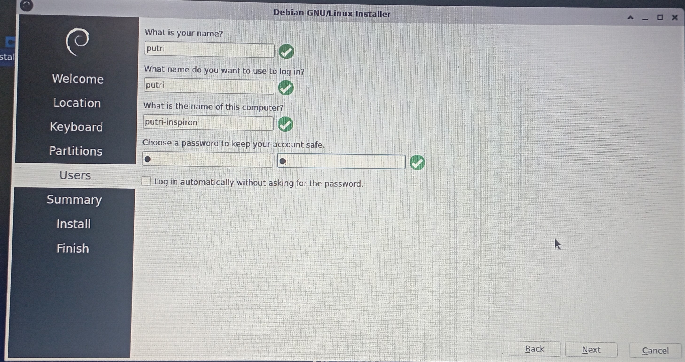

 16. Selanjutkan tekan next untuk proses instalilasi dan tunggu sampai selesai.

 
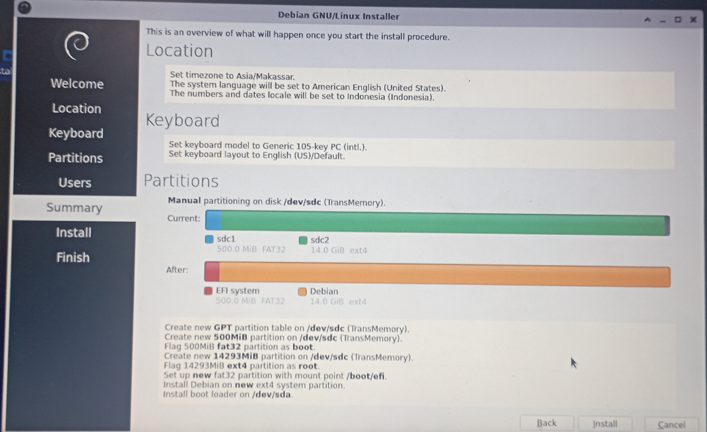

 
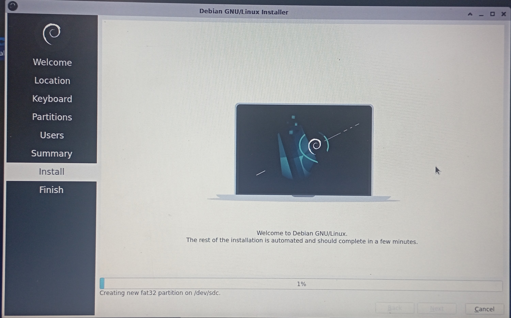

 Sumber materi :

 <a href ="https://github.com/khairulfuad09/instalasi-linux"> Github </a>

<a href="https://bikinidcard.com/flashdisk-bootable/">bikinicard.com</a>

