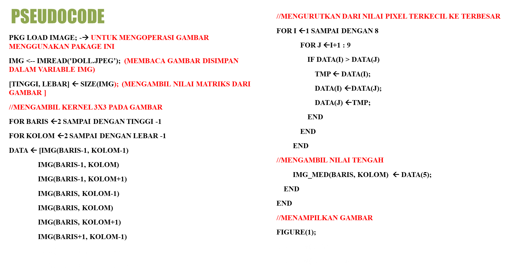
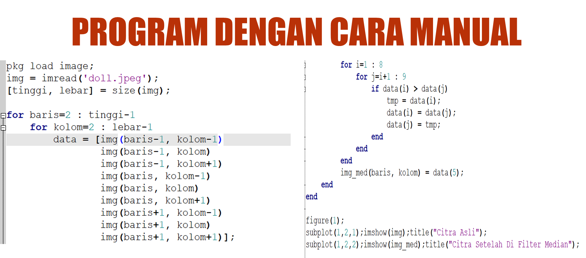
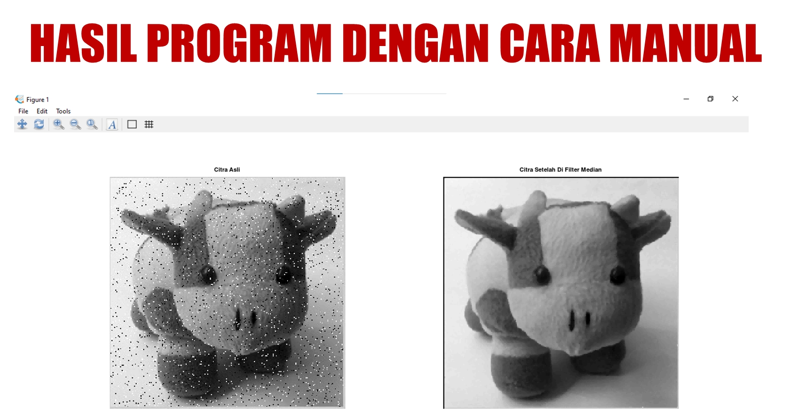
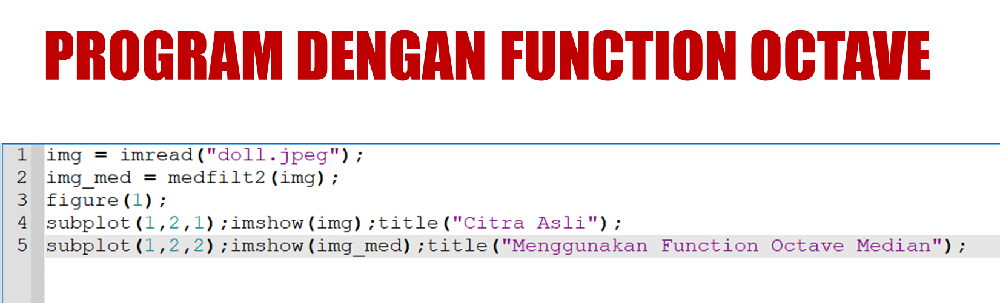
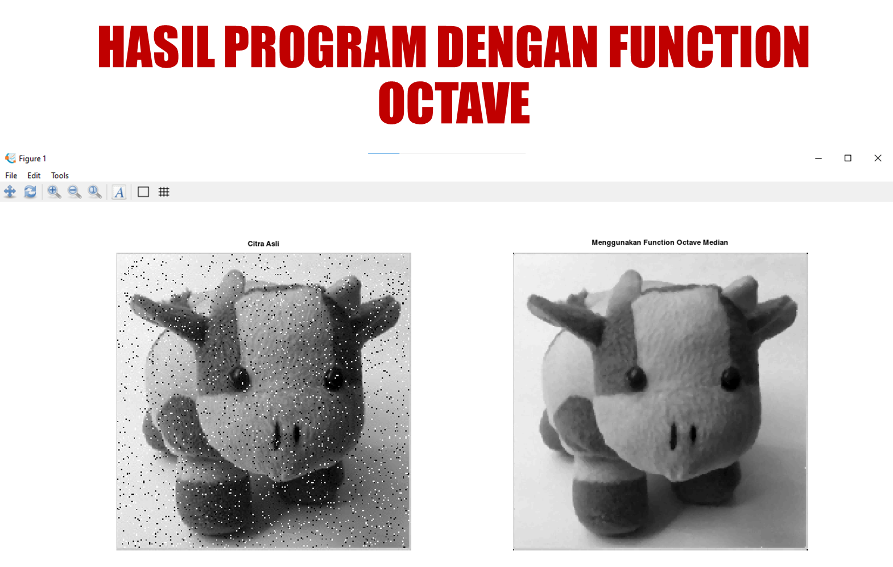
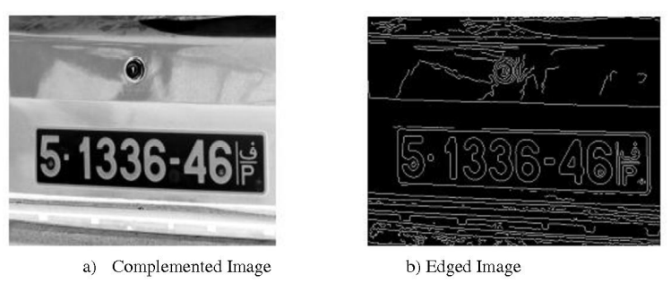
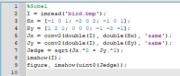
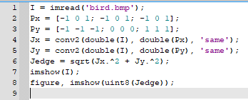
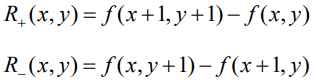
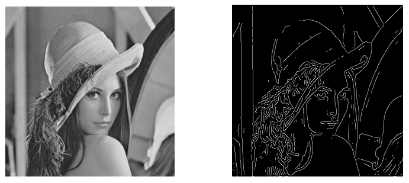

## Nama           :  Putri Tari Lestari
<h2>&nbsp &nbsp &nbsp &nbsp &nbsp &nbsp &nbsp Maisya Puspitas Sari</h2>
<h2>&nbsp &nbsp &nbsp &nbsp &nbsp &nbsp &nbsp M.Gymnastiar</h2>

## Matkul         : Pemrosesan Citra Digital
## Dosen Pengampu : Dr. Harja Santana Purba, M.Kom
<h2>&nbsp &nbsp &nbsp &nbsp &nbsp &nbsp &nbsp &nbsp &nbsp &nbsp &nbsp &nbsp &nbsp &nbsp &nbsp &nbsp Novan Alkaf Bahraini Saputra, S.Kom., M.T</h2>
 
 

<h2 align=center><u>Implementasi Octave Manual Low Filter Pass dan Low Filter Pass Pada Citra</u></h2>
 
 

## Apa itu Low Filter Pass dan Low Filter Pass?

Filter lolos rendah atau Low Filter Pass : Filter lolos rendah adalah jenis filter domain frekuensi yang digunakan untuk menghaluskan gambar. Ini melemahkan komponen frekuensi tinggi dan mempertahankan komponen frekuensi rendah.

High pass filter: High pass filter adalah jenis filter domain frekuensi yang digunakan untuk mempertajam gambar. Ini melemahkan komponen frekuensi rendah dan mempertahankan komponen frekuensi tinggi.

## Perbedaannya

Low Pass Filter
- Ini digunakan untuk menghaluskan gambar. 
- Ini melemahkan frekuensi tinggi. 
- Frekuensi rendah dipertahankan di dalamnya. 
- Ini memungkinkan frekuensi di bawah frekuensi terputus untuk melewatinya. 
- Ini terdiri dari resistor yang diikuti oleh kapasitor. 
- Ini membantu dalam menghilangkan efek aliasing. 

 High Pass Filtering
 - Ini digunakan untuk mempertajam gambar.
 - Ini melemahkan frekuensi rendah.
 - Frekuensi tinggi dipertahankan di dalamnya.
 - Hal ini memungkinkan frekuensi di atas memotong frekuensi untuk melewatinya.
 - Ini terdiri dari kapasitor yang diikuti oleh resistor.
 - Ini membantu dalam menghilangkan kebisingan.

 

 ## Implementasi di Octave

 1. Low Pass Filtering

 Kode program :

 

 Hasil Program :

 

 2. High Pass Filtering

 Kode program :

 

 Hasil Program :

 

 
 

 <h2 align=center><u>Implementasi Octave Manual High Bost Filtering</u></h2>
 
 

## Apa itu High Bost Filtering?

High Bost Filtering Merupakan salah satu bagian dari operasi yang dapat dilakukan untuk melakukan perbaikan citra.High boost  filtering dapat  membuat  citra  menjadi  lebih  tajam,  dengan  cara  meninggikan nilai-nilai frekuensi yang ada pada citra.
1. High boost filtering : proses filter yang berasal dari citra dengan dasar pemrosesannya menggunakan metode low pass filter dan high pass filter
2. High-Boost Filtering bertujuan untuk mempertahankan(mempertajam) komponen frekuensi tinggi yang mewakili detail gambar tanpa menghilangkan komponen frekuensi rendah. 

Proses :
- Hight Boost Filtering digunakan bilamana citra masukan lebih gelap daripada citra yang di inginkan.
- High- boost filter menghasilkan citra lebih teran dan lebih alami.

Langkah-langkah :

- Memblurkan gambar asli
- Mengurangi versi asli gambar dengan gambar yang buram(perbedaan yang dihasilkan disebut mask)
- Menambahkan mask ke dalam gambar asli

Cara hitung :

Highboost = a Original – Lowpass
          
           = (a – 1) Original + Original – Lowpass

           = (a – 1) Original + Highpass

- Jika a = 1, kita mendapatkan unsharp masking.
- Jika a >1, bagian citra original ditambahkan kembali ke citra hasil high 
pass filter.
Highboost = (a – 1) Original + Highpass

Implementasi di Octave :

Kode Program manual 

    

Hasil Program :

    

Ada juga implementasi dengan menggunakan fungsi dari Octave langsung, yaitu :

Kode program :

    

    

 
 

 <h2 align=center><u>Implementasi Octave Manual Madian Filtering</u></h2>
 
 

## Apa itu Median Filtering?

Median Filtering merupakan teknik penyaringan digital nonlinear, sering digunakan untuk menghilangkan noise. Penyaringan median sangat banyak digunakan dalam pemrosesan gambar digital karena mempertahankan tepi sambil menghilangkan <i>noise. Median Filtering</i> dilakukan pada matriks citra dengan cara mencari median dari piksel tetanggaan dengan menggunakan jendela yang menggeser piksel demi piksel.

Penerapan dari <i>median filtering</i> dapat berupa untuk peningkatan kualitas citra gambar yang mengalami penurunan mutu citra, misalnya karena mengandung cacat atau derau <i>(noise)</i>. Contohnya adalah bintik hitam atau putih yang muncul secara acak yang tidak diinginkan di dalam citra. bintik acak ini disebut dengan derau <i>(noise) salt & pepper.</i>

 

 

 

 

 
 

 <h2 align=center><u>Implementasi Octave Manual Edge Detection</u></h2>
 
 

Tepi (edge) adalah perubahan nilai intensitas derajat keabuan yang mendadak (besar) dalam jarak yang singkat. Tepi memiliki arah, dan arah ini berbeda-beda bergantung pada perubahan intensitas Tepi biasanya terdapat pada batas antara dua daerah yang berbeda intensitas dengan perubahan yang sangat cepat di dalam citra. 

Empat macam tepi: 
- tepi curam (step edge), 
- tepi landai (ramp edge), 
- tepi garis (line edge), dan 
- tepi atap (roof edge).

Tujuan :
- Pendeteksian tepi bertujuan untuk meningkatkan penampakan garis batas atau objek di dalam citra.
- Pendeteksian tepi mengekstraksi representasi gambar garis-garis di dalam citra.
- Pendeteksian tepi berguna dalam mengenali objek di dalam citra (image recognition).

 

### __Operator Gradien__
- Oparator Sobel
- Oparator Roberts
- Oparator Prewitt
- Operator Canny

 
#### __1. Operator Sobel__

Di bawah ini contoh lain pendeteksian tepi dengan operator Sobel, dimana hasil konvolusi diambangkan (thresholding) dengan T = 12.

#### Operator Sobel Menggunakan Fungsi Octave
- Kode :

- Output :

 

#### __2. Operator Prewitt__
Persamaan gradien pada operator Prewitt sama seperti operator Sobel, tetapi menggunakan nilai c = 1 :

Kekuatan tepi dihitung dengan rumus :

#### Operator Prewitt Menggunakan Fungsi Octave

- Kode :

- Output :

 

#### __3. Operator Roberts__

Operator Roberts sering disebut juga operator silang

Gradien Roberts dalam arah-x dan arah-y dihitung dengan rumus :

Dalam bentuk mask konvolusi :

- Contoh berikut ini memeperlihatkan pendeteksian tepi dengan operator Roberts :

#### Operator Roberts Menggunakan Fungsi Octave
- Kode :

 

- Output :

#### __4. Operator Canny__

Operator deteksi tepi yang terkenal karena dapat menghasilkan tepi dengan ketebalan 1 pixel

Langkah-langkah operator Canny:
- Haluskan citra I dengan penapis Gaussian: G * I
- Hitung gradien setiap pixel dengan salah satu dari 4 operator sebelumnya (misalnya operator Sobel)
- Jika nilai mutlak gradien suatu pixel melebihi nilai ambang T, maka pixel termasuk pixel tepi.
 

### __Kode Edge Detection Manual__
Kode :

Citra Asli :

Hasil :

#### __Perbedaan Hasil Keempat Operator__

Kesimpulan :
Dengan adanya jenis-jenis filter dalam pemrosesan citra di atas, kita bisa membuat sebuah citra baru sesuai dengan kebutuhan kita. Entah itu ingin menaikan ketajaman, menghilangkan noise, melihat tepi sebuah citra, mem-blurkan gambar dan banyak hal lainnya.