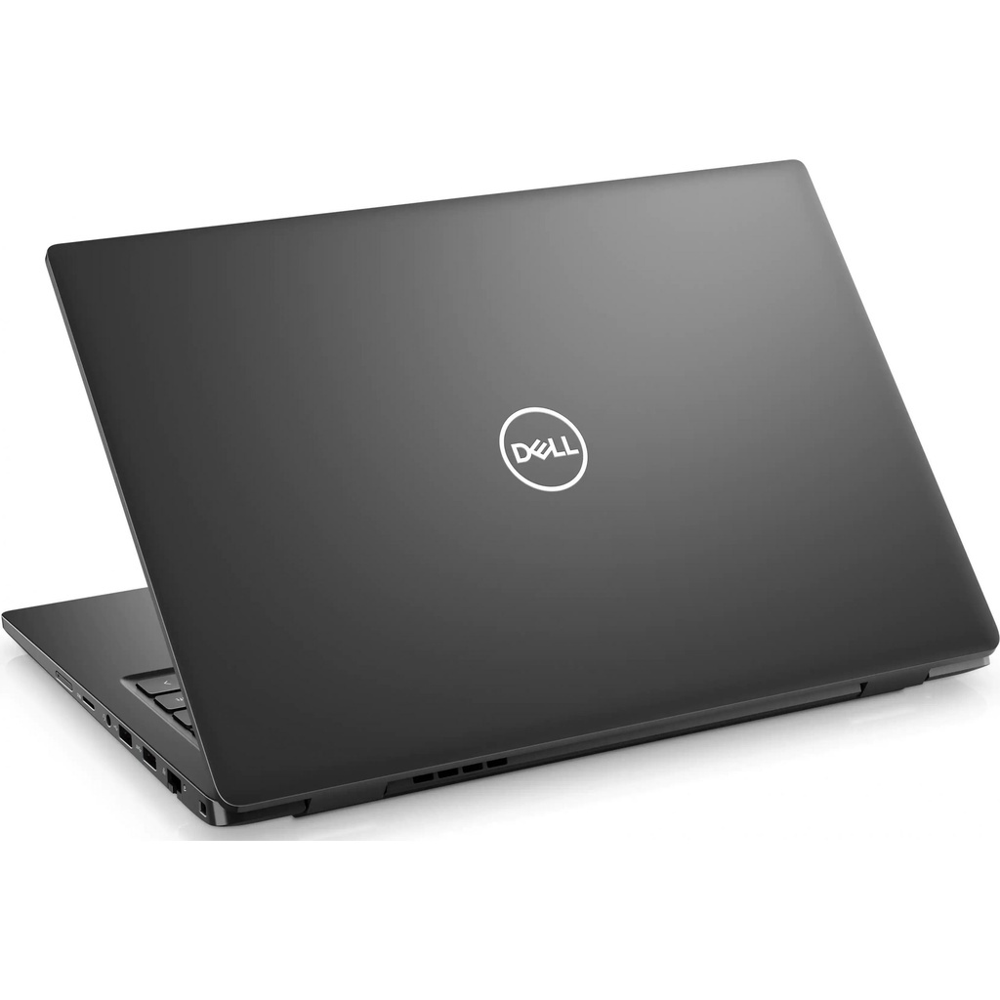

# BENDA PADA LAPTOP PRIBADI 

# 1. Laptop : DELL

Merk laptop saya adalah Dell.

Laptop Dell dibuat oleh perusahaan asal Amerika Serikat yang memiliki kantor pusat di Texas. Nama perusahaannya diambil dari nama pendirinya, yaitu Michael Dell. Sampai sekarang, Dell membuat berbagai produk elektronik, yaitu desktop, laptop, server, dan produk tablet PC. Produk-produk yang dihasilkan oleh perusahaan Dell tbanyak digunakan dan disukai oleh konsumennya karena dikenal sebagai salah satu laptop dengan kualitas terbaik dan juga harga yang cukup terjangkau. Oleh karena itu, sampai saat ini laptop keluaran perusahaan Dell masih tetap banyak dicari oleh para pengguna laptop yang ada di seluruh dunia, termasuk di Indonesia.

# 2. Sistem Operasi : Windows 10 Pro

Windows 10 jadi sistem operasi komputer pribadi yang dikembangkan oleh Microsoft sebagai bagian dari keluarga sistem operasi Windows NT. Dari laman digitek.id, tidak ada perbedaan yang mencolok antara Windows 10 Pro dan Home. Pihak Microsoft cuman menambahkan sedikit fitur baru untuk Windows 10 Pro. Contoh, BitLocker (metode perlindungan informasi untuk database); Device Guard dan Secure Boot; Hyper-V; Remote Desktop dan masih banyak lagi.

# 3. Prosesor : Intel Core i3

Prosesor sama dengan otak dari laptop, fungsi umumnya adalah mengolah perintah yang masuk kemudian dikeluarkan berupa output yaitu pemberi perintah

# 4. Software (Perangkat Lunak) 

Perangkat lunak (aplikasi) yang ada di laptop saya adalah :
a. Microsoft Office
b. Edit desain/gambar : CorelDraw, Photosop, PhotoScape
c. Bahasa pemrograman : Python, Visual Studio Code
d. Browser : Chrome, Microsoft Edge (Explore)
e. Edit Video : AVS Video, Filmora
f. Media membuka gambar dan video : GOM Player, Windows Media Player, MPC-HC x64, Film & TV, Foto, Picasa Photo Viewer
g. DLL.

# 5. Hardware (Perangkat Keras) : Laptop dan Mouse

# 6. Penyimpanan (Primer/Sekunder) : Sekunder (TOSHIBA MQ01ABD100)

# SEJARAH PERKEMBANGAN KOMPUTER

Komputer adalah alat yang dipakai untuk mengolah data menurut perintah yang telah diprogram. Kata komputer semula dipergunakan untuk menggambarkan orang yang perkerjaannya melakukan perhitungan aritmetika, dengan atau tanpa alat bantu, tetapi arti kata ini kemudian dipindahkan kepada mesin itu sendiri. Pada awalnya, pengolahan informasi hampir eksklusif berhubungan dengan masalah aritmatika, tetapi komputer modern dipakai untuk banyak tugas yang tidak berhubungan dengan matematika.

Cikal bakal komputer digital pertama dikembangkan pada 1930. Adalah Alan Turing yang pertama kali mengembangkan mesin tersebut. Ia merupakan peneliti matematika yang sukses mengembangkan mesin yang dapat menjalankan sekumpulan perintah. Berkat kontribusinya, mesin tersebut kemudian diberi nama mesin Turing (Turing Machine), termasuk sebuah simulasi gagasannya yang bernama uji Turing.

Komputer digital pertama dikembangkan oleh Konrad Zuse, seorang insinyur mesin asal Jerman. Sebelum perang dunia kedua pecah, Zuse membangun komputer digital pertama bernama Z1 yang dapat diprogram. Pada 1936 di ruang tamu orang tuanya di Berlin, ia merakit pelat logam, pin, dan menciptakan sebuah mesin yang dapat melakukan perhitungan tambah dan kurang. Meskipun model awal komputer tersebut dihancurkan saat Perang Dunia II, Zuse digadang sebagai pencipta komputer digital pertama. Selama perang dunia kedua berlangsung tepatnya pada 1943, John Mauchly berhasil menciptakan mesin bernama Electronic Numerical Integrator and Calculator (ENIAC). Awal mula diciptakannya ENIAC adalah untuk membantu Angkatan Darat dalam memprediksi serangan. ENIAC sendiri dibekali dengan kemampuan analisa yang dapat menghitung ribuan masalah dalam hitungan detik. ENIAC memiliki berat hingga 30 ton dan membutuhkan ruang seluas 457 meter persegi untuk menempatkan mesin komputer tersebut. Hal ini disebabkan oleh banyaknya komponen pendukung yang dimiliki ENIAC, seperti 40 lemari kabinet, 6.000 sakelar, serta 18.000 tabung hampa.

Tahun 1970-an dapat dibilang sebagai era kelahiran komputer pribadi. Ditandai dengan munculnya Xerox Alto, sebuah komputer pribadi yang dapat menjalankan perintah seperti mengirimkan e-mail dan mencetak (print) dokumen.

Memasuki abad ke-21, laju perkembangan perangkat komputer semakin pesat, seiring dengan perkembangan teknologi. Penggunaan disket dan CD-ROM mulai tersisihkan oleh media penyimpanan portabel yang lebih canggih, yakni USB drive. Sementara itu, Apple semakin gencar menelurkan inovasi terbaru lewat sistem operasi bernama Mac OS X. Microsoft pun sebagai kompetitor juga meluncurkan sistem operasi yang lebih modern, Windows XP. Hingga pada 2006, tren penggunaan laptop semakin menjamur di masyarakat. Hal ini turut didorong oleh hadirnya perangkat laptop MacBook Pro yang diperkenalkan oleh Steve Jobs. Perkembangan MacBook kembali dilanjutkan oleh generasi terbaru MacBook Air pada 2007. Pada tahun yang sama, Steve Jobs turut memperkenalkan iPhone untuk pertama kalinya, diikuti oleh iPad pada 2010.

Tahun 2011 ditandai sebagai tahun lahirnya berbagai penemuan Internet of Things (IoT). Nest Learning Thermostat yang hadir pada tahun ini kemudian dikenal sebagai perangkat IoT pertama di dunia. Selanjutnya, berbagai produk IoT lainnya semakin menjamur di pasaran. Sebut saja seperti Apple Watch yang hadir pada 2015. Untuk pertama kalinya, Apple turut mengumumkan iPadOS, sebuah sistem operasi yang dikhususkan untuk iPad.

_Artikel di Kompas.com dengan judul "Sejarah Komputer dan Perkembangannya dari Masa ke Masa", Klik untuk baca: https://tekno.kompas.com/read/2021/04/12/10480027/sejarah-komputer-dan-perkembangannya-dari-masa-ke-masa?page=all.
Penulis : Kevin Rizky Pratama
Editor : Yudha Pratomo_
